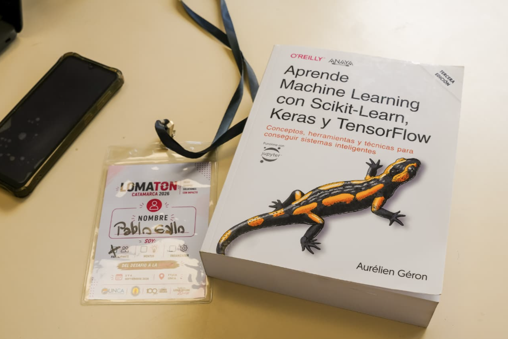
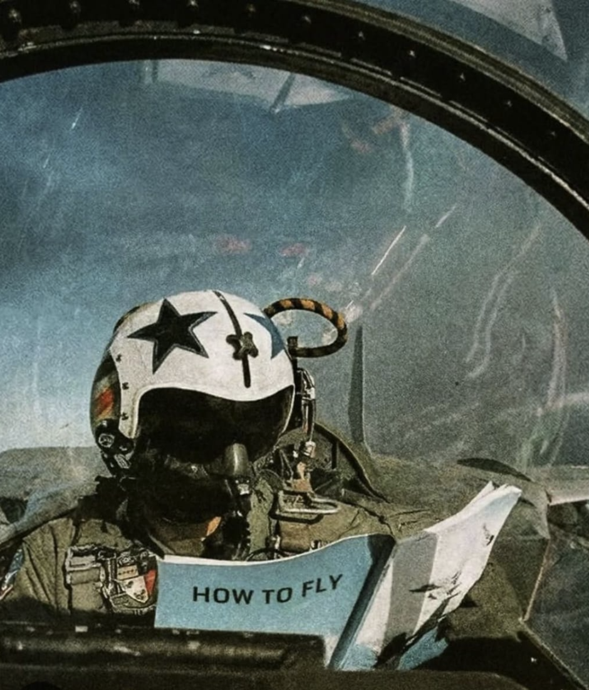

<h1 align="left">
  
  Hi there, my name is Pablo Gallo. Nice to meet you!
</h1>

**Advanced informatic engineering student | Investigator in training (With some scholarship)**  
*I do MLOps, Computer Vision and high performance backend architectures*

I'm from Catamarca, Argentina  
And you can contact me here: [gallopabloj@gmail.com](mailto:gallopabloj@gmail.com)

---

### About me:
Studing informatic engineer in UNCa (Universidad Nacional de Catamarca). I'm working in machine learning operations, their workflows, and their software engineer to make high-performance, low-latency computer vision models for strange hardware (something weird that an electronic engineering student did) feel like i'm Dr. Grace at Hail Mary trying to operate something that Rocky did (the best book ever did amaze! amaze! amaze!).
Also like to reed bocks. That's a new hobby, i read more than ten books the last year and their topics were like everything. Go through programming, geopolitics, economy, history, even science fiction (like Project Hail Mary or The Martian. And if you have some other like that tell me it now!!!).
Anyway, I'm starting to use English and you can see it in my grammar too poor. Thanks for being patient with me!

For the other part of the information I will continue with my native language, Spanish.

* **Investigación:** Becario BIET desarrollando estándares de inferencia y profiling multicapa para visión por computadora.
* **Industria:** 1.er puesto en el Hackathon **LOMATON** (Loma Negra / FTyCA - UNCa) por solución de sensado y visión artificial industrial.
* **Certificación:** *Fundamentals of Deep Learning* — **NVIDIA Deep Learning Institute**.

---

### Stack Tecnológico & Especialidades

- **MLOps & Computer Vision:** PyTorch, Ultralytics YOLO, OpenCV, ONNX Runtime, Roboflow Supervision, optimización y cuantización de modelos, telemetría y profiling (P95, FPS).
- **Backend & Sistemas Críticos:** Python, FastAPI, Django REST Framework, WebSockets (FastAPI / Django Channels).
- **Bases de Datos:** PostgreSQL, modelado relacional formal (BCNF), consistencia transaccional ACID, PL/pgSQL.
- **Hardware & Sensado:** Integración serial software-hardware, prototipado con microcontroladores (Arduino), adquisición de datos visuales.

---

### Proyectos Destacados

#### [UNCa-Interfaz (UNCaLens)](https://github.com/GallitoGod/UNCa-Interfaz)
Plataforma desktop de inferencia y visión artificial agnóstica a arquitectura. 
* Backend desacoplado en **FastAPI** con comunicación bidireccional vía **WebSockets**.
* Pipeline optimizado para ejecución sobre **ONNX Runtime** (GPU/CPU).
* Monitoreo de telemetría, latencia neta, percentil P95 y visualización reactiva en Electron.
  
Este sistema inició con el propósito de ser sencillo y facilitar la inferencia de modelos; hoy en día es capaz incluso de analizar modelos en benchmarks. Es un sistema del cual me siento muy contento. Está lleno de errores y parches de IA mal puestos, lo sé, pero el producir este sistema fue en esencia lo que me permitió entender la complejidad y la profundidad de los modelos de RNC y tengo pensado, una vez termine de programarlo, refactorizarlo entero y generar una MUY detallada documentación de este sistema, porque aunque de seguro existen algunos mucho mejores y más eficaces, este es mío, y es la demostración de que mi esfuerzo tiene recompensas. 

#### [TicketAPI-Poncho](https://github.com/GallitoGod/TicketAPI-Poncho)
Backend transaccional de alta concurrencia con motor algorítmico adaptativo de precios. 
* Flujos transaccionales críticos bajo estrictas garantías **ACID** en PostgreSQL.
* Motor de tarificación dinámica basado en métricas normalizadas de demanda.
* Optimización de costos operativos mediante ingesta eficiente de APIs externas.
* Documentación formal completa: Especificación de Requerimientos de Software (ERS) y contratos OpenAPI.
  
Ya que están, pueden ver la documentación de este proyecto. En ella, fuera del ERS, se explica el proceso creativo y análisis de las variables que intervienen en el movimiento del precio de los tickets y cómo funciona ese algoritmo. Por cuestiones de conflicto con la ley, no se permite regular precios mediante movimientos estocásticos (no puedo usar regresiones); el sistema es totalmente determinista, con una gran ventaja: su forma de variar el valor también mide la subjetividad y el alcance de los artistas. Esto fue así por un análisis muy divertido que se encuentra documentado (y el proceso creativo en bruto, escrito en forma de chiste, se encuentra en el repositorio como un Jupyter Notebook).

---

### Formación y Bases de Ingeniería
Desarrollo respaldado por el estudio formal de literatura de referencia en producción:
* *Designing Machine Learning Systems* (Chip Huyen)
* *Hands-On Machine Learning with Scikit-Learn, Keras, and TensorFlow* (Aurélien Géron)
* *Python for Data Analysis* (Wes McKinney)
* *Data Science from Scratch* (Joel Grus)
* *Introducción a la teoría de autómatas, gramáticas y lenguajes* (Gaudioso & García Saiz)

### Some images that explain my hands on experience with MLOps:
<table>
  <tr>
    <td width="60%">
      
    </td>
    <td width="40%">
      
    </td>
  </tr>
</table>

Tan solo tengo 22 años, espero terminar pronto la universidad y poder seguir especializándome en estas áreas de conocimiento. 

PD: Gay el que use alguna APIKey olvidada en algún repositorio por error (es broma, pero no roben APIKeys. Eso es malo).
